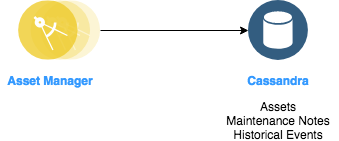

# Microprofile based Microservice Apps Integration with Cassandra

## Table of Contents

* [Introduction](#introduction)
* [How it works](#how-it-works)
* [API Endpoints](#api-endpoints)
* [Implementation](#implementation)
    * [Microprofile](#microprofile)
* [Features and App details](#features)
* [Deploying the App](#deploying-the-app)
    + [IBM Cloud Private](#ibm-cloud-private)
    + [Docker Edge](#docker-edge)
    + [Run Asset Service locally](#run-asset-service-locally)
* [DevOps Strategy](#devops-strategy)
* [References](#references)

## Introduction

This project is built to demonstrate how to build Asset Management Microservice application using Microprofile.
This application provides CRUD operations from a NoSQL database [***Cassandra***](http://cassandra.apache.org/).

- Based on [MicroProfile](https://microprofile.io/).
- Persist asset data to Cassandra.
- Deployment options for local environment and ICP.

## How it works

The Asset Management Microservice serves 'IBM Cloud Native Reference Architecture' suite, available at
https://github.com/ibm-cloud-architecture/refarch-asset-analytics. Though it is a part of a bigger application,
the Asset Management service is itself an application that persists the data of assets to Cassandra database.

<p align="center">
    
</p>

## API Endpoints

#### Create an asset

```
POST   /assetmanager/assets
```
Asset object must be passed as JSON object in the request body with the following format:

```
{
 "id":"1",
 "os":"testdata",
 "version":"testdata",
 "type":"testdata",
 "ipAddress":"testdata",
 "antivirus":"testdata",
 "rotation":1,
 "current":1,
 "pressure":1,
 "flowRate":1,
 "temperature":1,
 "riskRating":-1,
 "latitude":"testdata",
 "longitude":"testdata",
 "creationDate":"2018-11-09T17:02:37-06"
}
```

On success, the below is returned.

```
{
 "id":"1",
 "os":"testdata",
 "version":"testdata",
 "type":"testdata",
 "ipAddress":"testdata",
 "antivirus":"testdata",
 "rotation":1,
 "current":1,
 "pressure":1,
 "flowRate":1,
 "temperature":1,
 "riskRating":-1,
 "latitude":"testdata",
 "longitude":"testdata",
 "creationDate":1541804557000
}
```

#### Create an event

```
POST   /assetmanager/events
```
AssetEvent object must be passed as JSON object in the request body with the following format:

```
{
 "id":"1", 
 "current": 1,
 "rotation": 1,
 "pressure": 28,
 "temperature": 28
}
```

On success, the below is returned.

```
{
    "id": "1",
    "rotation": 1,
    "current": 1,
    "pressure": 28,
    "temperature": 28
}
```

#### Return all assets

```
GET     /assetmanager/assets
```
On success, returns all the assets in the data store.

#### Return all assets by id

```
GET     /assetmanager/assets/{id}
```

On success, Returns all assets available in the datastore based on `Id`.

#### Return all assets by type

```
GET     /assetmanager/assets/type/{type}
```

On success, Returns all assets available in the datastore based on `Type`.

#### Return all events

```
GET     /assetmanager/events
```
On success, returns all the asset events in the data store.

#### Return all events based on the event history

```
GET     assetmanager/events/{fromDate}/{toDate}
```
For eg. `assetmanager/events/2018-07-19 12:10:12 /2018-10-02 22:23:20`

On success, returns all the asset events between the dates you mentioned.

#### Update an asset

```
PUT     /assetmanager/assets/{id}
```

Asset object must be passed as JSON object in the request body with the following format:

```
{
 "id":"1",
 "os":"updtestdata",
 "type":"updtestdata",
 "ipAddress": "0.0.0.0",
 "version": "1.0.0",
 "antivirus":"updtestdata"
}
```

On success, `Asset with ID 1 got updated` is returned.

#### Delete an asset

```
DELETE     /assetmanager/assets/{id}
```

On success, `Asset with ID 1 got deleted` is returned.

### Implementation

#### [MicroProfile](https://microprofile.io/)

MicroProfile is an open platform that optimizes the Enterprise Java for microservices architecture. In this application,
we use [**MicroProfile 1.3**](https://github.com/eclipse/microprofile-bom).

You can make use of this feature by including this dependency in Maven.

```
<dependency>
    <groupId>org.eclipse.microprofile</groupId>
    <artifactId>microprofile</artifactId>
    <version>1.3</version>
    <type>pom</type>
    <scope>provided</scope>
</dependency>
```

You should also include a feature in [server.xml](https://github.com/ibm-cloud-architecture/refarch-cloudnative-micro-orders/blob/microprofile/src/main/liberty/config/server.xml).

```
<server description="Sample Liberty server">

  <featureManager>
      <feature>microprofile-1.3</feature>
  </featureManager>

  <httpEndpoint httpPort="${default.http.port}" httpsPort="${default.https.port}"
      id="defaultHttpEndpoint" host="*" />

</server>
```

### Features

1. Java SE 8 - Used Java Programming language

2. [CDI 1.2](https://jcp.org/en/jsr/detail?id=346) - Used CDI for typesafe dependency injection

3. [JAX-RS 2.0.1](https://jcp.org/en/jsr/detail?id=339) -
JAX-RS is used for providing both standard client and server APIs for RESTful communication by the MicroProfile applications.

4. [Eclipse MicroProfile Config](https://github.com/eclipse/microprofile-config) -
Configuration data comes from different sources like system properties,
system environment variables, *.properties etc. These values may change dynamically.
This feature enables us to pick up configured values immediately after they got changed.

    The config values are sorted according to their ordinal. We can override the less important values from outside.
    The config sources three locations by default, and the list below shows their rank in priority from most to least:

    - System.getProperties()
    - System.getenv()
    - all META-INF/microprofile-config.properties files on the ClassPath.

    In our sample application, we obtained the configuration programmatically.

## Deploying the App

You can deploy the application locally on your system or on IBM Cloud Private based on your convenience.

### IBM Cloud Private

To deploy it on IBM Cloud Private, please follow the instructions provided
[here](./docs/icp.md).

### Docker Edge

To deploy it on Docker Edge, please follow the instructions provided
[here](./docs/dockeredge.md).

### Run Asset Service locally

To deploy the app locally and test the individual service, please follow the instructions provided
[here](./docs/local.md).

## DevOps strategy

You can use [Microclimate](https://microclimate-dev2ops.github.io/) as your end-to-end development environment. It helps us from coding the application locally to deploying the application using a pipeline.

Using this, you can

- Have a simple containerized dev environment
- Load test your application with JMeter
- Templates are in built
- Built in logging
- Easy deployments
- End-to-end environment from development to deployment.

To integrate the app with [Microclimate](https://microclimate-dev2ops.github.io/) on IBM Cloud Private, please follow the instructions [here](https://github.com/ibm-cloud-architecture/refarch-asset-manager-microservice/blob/microprofile/docs/microclimate.md).

## References

1. [MicroProfile](https://microprofile.io/)
2. [MicroProfile Config on Liberty](https://www.ibm.com/support/knowledgecenter/en/SSAW57_liberty/com.ibm.websphere.wlp.nd.multiplatform.doc/ae/twlp_microprofile_appconfig.html)
3. [Microclimate](https://microclimate-dev2ops.github.io/)
