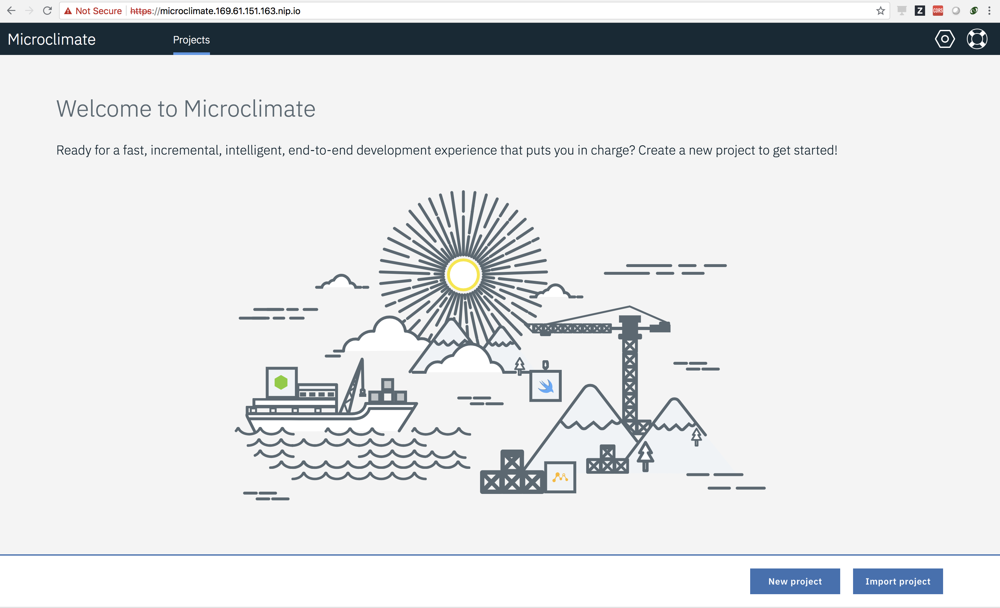

# Integrating the Application with Microclimate on IBM Cloud Private

## Table of Contents

* [Introduction](#introduction)
* [Pre-requisites](#pre-requisites)
* [Set up your environment](#set-up-your-environment)
* [Installing Microclimate on ICP](#installing-microclimate-on-icp)
* [Set Up Cassandra](#set-up-cassandra)
* [Integrating the App](#integrating-the-app)
* [Validate the App](#validate-the-app)
* [Delete the App](#delete-the-app)
* [References](#references)

## Introduction

[Microclimate](https://microclimate-dev2ops.github.io/) provides you an end to end development. It allows you to conatineruze your application and deliver them on Kubernetes using an automated DevOps pipeline based on Jenkins.

This project provides you a reference for integrating your existing microservie application with microclimate.

## Pre-requisites

[IBM Cloud Private Cluster](https://www.ibm.com/cloud/private)

Create a Kubernetes cluster in an on-premise datacenter. The community edition (IBM Cloud Private-ce) is free of charge.
Follow the instructions [here](https://www.ibm.com/support/knowledgecenter/en/SSBS6K_2.1.0.2/installing/install_containers_CE.html) to install IBM Cloud Private-ce.

[Helm](https://github.com/kubernetes/helm) (Kubernetes package manager)

Follow the instructions [here](https://github.com/kubernetes/helm/blob/master/docs/install.md) to install it on your platform.
If using IBM Cloud Private version 2.1.0.2 or newer, we recommend you to follow these [instructions](https://www.ibm.com/support/knowledgecenter/SSBS6K_2.1.0.2/app_center/create_helm_cli.html) to install helm.

## Set up your environment

1. Your [IBM Cloud Private Cluster](https://www.ibm.com/cloud/private) should be up and running.

2. Log in to the IBM Cloud Private.

<p align="center">
    
</p>

3. Go to `admin > Configure Client`.

<p align="center">
    
</p>

4. Grab the kubectl configuration commands.

<p align="center">
    
</p>

5. Run those commands in your terminal.

6. If successful, you should see something like below.

```
Switched to context "xxx-cluster.icp-context".
```
7. Run the below command.

`helm init --client-only`

You will see something similar to the below message.

```
$HELM_HOME has been configured at /Users/user@ibm.com/.helm.
Not installing Tiller due to 'client-only' flag having been set
Happy Helming!
```

8. Verify the helm version

`helm version --tls`

You will see something like below.

```
Client: &version.Version{SemVer:"v2.7.3+icp", GitCommit:"27442e4cfd324d8f82f935fe0b7b492994d4c289", GitTreeState:"dirty"}
Server: &version.Version{SemVer:"v2.9.1", GitCommit:"20adb27c7c5868466912eebdf6664e7390ebe710", GitTreeState:"clean"}
```

## Installing Microclimate on ICP

1. Create `greencompute` namespace.

`kubectl create namespace greencompute`

2. Create *service accounts* for devops and jenkins components &  Microclimate’s Portal and File Watcher as below.

```
kubectl create serviceaccount gc-devops-sa --namespace greencompute
kubectl create serviceaccount gc-micro-sa --namespace greencompute
```

3. Create *secrets* for docker registry and helm.

```
kubectl create secret docker-registry microclimate-registry-secret --docker-server mycluster.icp:8500 --docker-username <username> --docker-password <password> --docker-email null --namespace greencompute
kubectl create secret generic microclimate-helm-secret --from-file=cert.pem=$HELM_HOME/cert.pem --from-file=ca.pem=$HELM_HOME/ca.pem --from-file=key.pem=$HELM_HOME/key.pem --namespace greencompute
```

Before creating the secret for helm, make sure `$HELM_HOME` variable is set. Run the below command to set it.

`export HELM_HOME=~/.helm`

4. Create *patches* for both the service accounts.

```
kubectl patch serviceaccount gc-devops-sa -p '{"imagePullSecrets": [{"name": "microclimate-registry-secret"}, {"name": "microclimate-helm-secret"}]}' --namespace greencompute
kubectl patch serviceaccount gc-micro-sa -p '{"imagePullSecrets": [{"name": "microclimate-registry-secret"}, {"name": "microclimate-helm-secret"}]}' --namespace greencompute
```

5. Create required roles and binding. You can find the devops.yaml [here](docs/devops.yaml) and micro.yaml [here](docs/micro.yaml)

```
kubectl apply -f devops.yaml
kubectl apply -f micro.yaml
```

6. Istall the microclimate on ICP using the helm command as below.

```
helm install --name microclimate --namespace greencompute --set global.rbac.serviceAccountName=gc-micro-sa,jenkins.rbac.serviceAccountName=gc-devops-sa,hostName=microclimate.<PROXY_IP>.nip.io,jenkins.Pipeline.Registry.Url=mycluster.icp:8500/greencompute,jenkins.Master.HostName=jenkins.<PROXY_IP>.nip.io ibm-charts/ibm-microclimate --tls
```

7. It takes some time to get all its components up. After sometime, you will be able to access the Microclimate portal at the this URL `https://microclimate.<PROXY_IP>.nip.io`

<p align="center">
    
</p>

## Set Up Cassandra

1. Add the `helm` package repository containing our `cassandra` instance.

```
helm repo add cassandra https://raw.githubusercontent.com/ibm-cloud-architecture/refarch-asset-manager-microservice/microprofile/docs/charts/services
```

2. Install Cassandra on ICP in `greencompute` namespace. 

```
helm install --name cassandra cassandra/cassandra --namespace greencompute --tls
```

Note: If using IBM Cloud Private version older than 2.1.0.2, use `helm install --name cassandra cassandra/cassandra --namespace greencompute`

After a minute or so, the containers will be deployed to the cluster.

## Integrating the App


